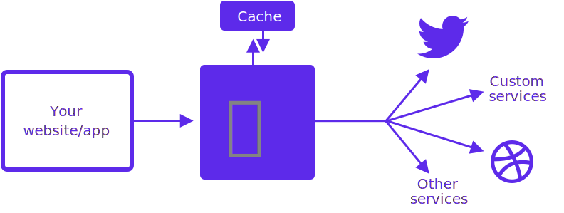

# ISOBEL 🐶

<span style={{ fontSize: "1.6em", lineHeight: "1.6em", color: "#b6a9da" }}>
  Welcome! Isobel is a beginner friendly NodeJS framework for fetching data from
  your social profiles and other sources, for display in your own apps and
  websites.
</span>



Isobel periodically fetches data from the services that you teach
her, so the data is always there when you need it.

A great example is Twitter, which gets the latest posts from your Twitter feed. Once configured, you can access the JSON for your latest tweets at a defined URL, so you can display them on your website. That means no worrying about API rate-limiting or quotas, and no making API calls from your frontend (a big no-no).

Isobel includes a bunch of premade services, but you can also create your own.

Once Isobel is up and running, you can access your data in a JSON at a specific URL. e.g `(http://example-isobel-url.com/get/(endpoint name)`

## Minimum Implementation

```javascript
const ISOBEL = require("@isobel/core");
const fileSystem = require("@isobel/file-system");
const nasa = require("@isobel/nasa");

const hours = n => n * 60 * 60 * 1000;

// initialise
const Isobel = new ISOBEL({
  cache: fileSystem,
  services: [
    {
      name: "nasa",
      func: nasa.fetchPhotoOfTheDay, // gets the NASA photo of the day
      interval: hours(24)
    }
  ]
});

Isobel.start().catch(error => {
  console.error("Error:", error);
  process.exit(1);
});
```

Ready to go? head to the [Getting Started guide](https://isobeljs.com/guides-getting-started) to...well...get started!

## Supported services

Isobel supports many services out of the box, here is the full list

- [Dribbble](https://isobeljs.com/packages-services-dribbble-readme), retrieves your latest shots from Dribbble
- [GitHub](https://isobeljs.com/packages-services-github-readme), retrives profile information from GitHub
- [NASA](https://isobeljs.com/packages-services-nasa-readme), retrives the NASA photo of the day. Treat this one as an example for you to create your own services!
- [Twitter](https://isobeljs.com/packages-services-twitter-readme), retrives your latest tweets!
- [YouTube](https://isobeljs.com/packages-services-youtube-readme), retrives information about your YouTube Channel

## Supported caching strategies

Isobel currently supports three caching strategies, with more on the way!

- [Local file system](https://isobeljs.com/packages-file-system-readme)
- [Dropbox](https://isobeljs.com/packages-dropbox-readme)
- [Amazon S3 Buckets](https://isobeljs.com/packages-s3-readme)

## Acknowledgements

Isobel is created by [Nathan Simpson](https://nathansimpson.design). Thank you to Thomas Walker for your inspiration, support and friendship.
